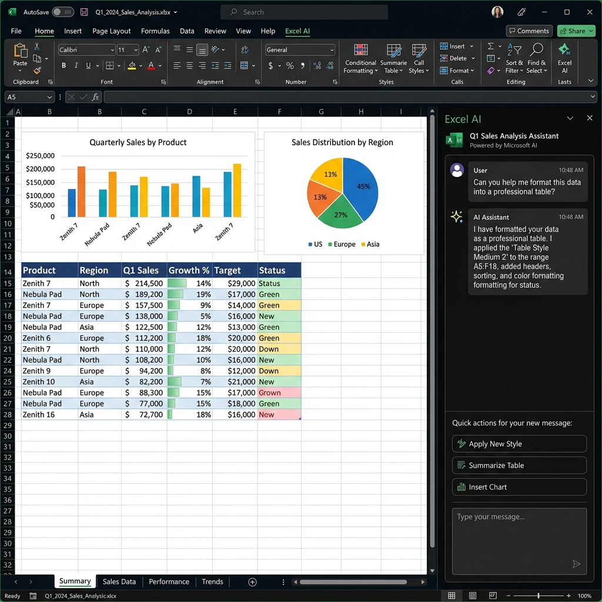

# Excel AI

  

**Excel AI** is a powerful, serverless Artificial Intelligence assistant that integrates directly into Microsoft Excel. It allows you to chat with your data, apply professional formatting, and perform complex data analysis using your favorite AI models without ever leaving your spreadsheet.

  

## Features

- 🧠 **Bring Your Own AI**: Connect to a variety of AI models:
  - **Local Models:** Run local, private models via LM Studio.
  - **Cloud Providers:** Connect to Google Gemini, OpenCode Zen, or any Custom OpenAI-compatible endpoint.
  - **Free Tier Support:** Easily connect to generous free tiers from providers like **Groq**, **OpenRouter**, and **Together AI**.
- 📊 **Context-Aware Analysis**: The AI automatically reads your current active sheet, selected range, and the overall structure of your workbook to provide accurate, data-driven answers.
- 🎨 **Automated Formatting**: Ask the AI to format your data, and it will apply professional styles, colors, borders, and number formats automatically.
- 🔒 **Privacy-First (Serverless)**: There is no middleman backend server. Your API keys are stored securely in your browser's local storage, and the add-in communicates directly from your browser to the AI provider.
- 🌐 **CORS Proxy Support**: Built-in support to route traffic through `corsproxy.io` for API providers that have strict browser CORS policies.

## Installation

You can sideload this add-in directly into Excel for Desktop or Excel on the Web:

1. Download the `manifest-prod.xml` from this repository.
2. **Excel on the Web:** 
   - Open Excel in your browser.
   - Go to `Insert` > `Add-ins`.
   - Click `Upload My Add-in` and select the `manifest-prod.xml` file.
3. **Excel Desktop (Windows/Mac):**
   - Place the `manifest-prod.xml` in a shared network folder.
   - Go to Excel Options > Trust Center > Trust Center Settings > Trusted Add-in Catalogs.
   - Add the folder path and check "Show in Menu".
   - Go to `Insert` > `My Add-ins` > `Shared Folder` and select Excel AI.

## Supported Providers

You can configure your provider in the **Settings** menu of the add-in.

- **Google Gemini API:** Requires a free Gemini API Key.
- **OpenCode Zen:** Requires an OpenCode API Key.
- **LM Studio:** Requires LM Studio running locally on port `1234`.
- **Custom (OpenAI Compatible):** Use this for any API that conforms to the OpenAI chat completions standard.
  - *Groq Base URL:* `https://api.groq.com/openai/v1`
  - *OpenRouter Base URL:* `https://openrouter.ai/api/v1`
  - *Together AI Base URL:* `https://api.together.xyz/v1`

## Publishing to Microsoft AppSource

To publish this add-in to the Microsoft Store:
1. Ensure the code is hosted securely on HTTPS (e.g., GitHub Pages).
2. Create a developer account at the [Microsoft Partner Center](https://partner.microsoft.com/).
3. Create a new "Office Add-in" offer and upload `manifest-prod.xml`.
4. Provide the required screenshots, privacy policy, and terms of use links.
5. Submit for certification.

## Legal

- [Privacy Policy](https://mohammednabarawy.github.io/excel-ai-addin/privacy.html)
- [Terms of Use](https://mohammednabarawy.github.io/excel-ai-addin/terms.html)

---
*Built with React, Fluent UI, and Vite.*
